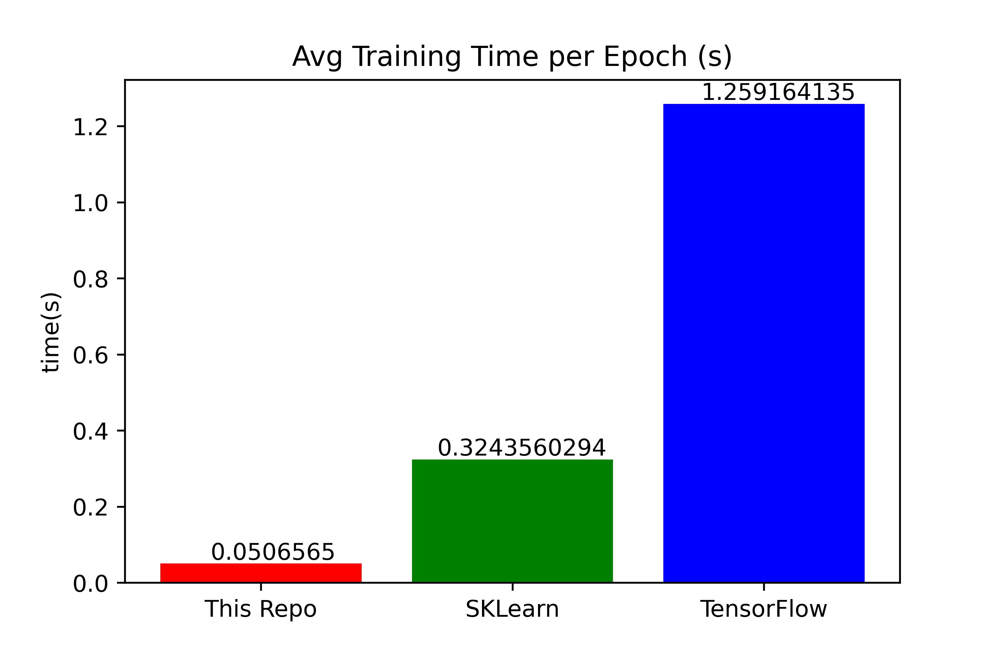

# C++ Neural Network

This is a lightweight implementation of a multi-layer perceptron neural network in C++. It provides a simple and efficient way to read an ARFF file, preprocess the data, and train and cross-validate a multilayer perceptron network for classification or regression tasks.

The main goal of this library is to optimize the training time of the network. The library uses the Intel Math Kernel Library for optimized matrix computations.  

## Performance  
Here are some results I got on my local machine: <p align="center"/>   </p>
This test was performed on a network with 2 hidden layers with 100 neurons each and relu activation function for 50 epochs over 10-fold cross-validation. This test was performed on the 'adult-big.arff' dataset, which can be found in the src folder. The dataset contains about 45000 training entries and about 4000 test entries for 10-fold validation, which means this network performed the computations for each training in an average of just over 1 microsecond. See the Optimization issue for more info.

## Dependencies

To use this code, you must have the Intel Math Kernel Library installed. 
- Make sure your system meets the [system requirements](https://www.intel.com/content/www/us/en/developer/articles/system-requirements/oneapi-math-kernel-library-system-requirements.html), you don't need to worry about Data Parallel C++ (for now). Any relatively up to date system should be fine.  
- Download the appropriate installer [here](https://www.intel.com/content/www/us/en/developer/tools/oneapi/onemkl-download.html). The online or offline installer will guide you through the process, or you can see installation instructions for your package manager at the same link.  

## Getting Started

To get started, clone the repository and include the "Network.h" header file in your C++ project.
You must use the #define CLASS "yourclasslabel" macro **before** you include the Network.h file. (the default is "class")  
NOTE: Your attribute names **cannot** contain spaces, even if they are surrounded by quotes. Even if your class label is surrounded by quotes, you need to define it as a c++ string (i.e "'ClassLabel'" or "\\"ClassLabel\\"") Do Not include a semicolon.
```cpp
#define CLASS "Class"
#include "Network.h"
```
The library is intended to optimize the training time, so it performs the "one hot encoding" for categorical values when it reads the file instead of doing the encoding for every training. This means that the file's metadata is needed to manipulate the dataset. Instead of assuming the last attribute in the metadata is the class label, the class label must be explicitly stated when the code is compiled.  
The main function in "main.cpp" provides an example of how to load a dataset from an ARFF file, preprocess it, and train a multi-layer perceptron (MLP) network using cross-validation. You can modify this code to fit your own use case.


## ARFF Dataset

This library provides a class for loading and preprocessing datasets in ARFF format. To load an ARFF dataset, use the following static method:
```cpp
ARFFDataset data;
ARFFDataset::loadARFF(filename, data);
```

This will load the dataset from the specified file and store it in a ARFFDataset object named "data".
For the python enjoyers you can also use
```cpp
auto data = ARFFDataset::loadARFF(filename);
```

and for the old school

```cpp
ifstream inFile(filename);
ARFFDataset data;
inFile>>data;
```
## Preprocessing

This library provides several preprocessing functions for handling missing values and normalizing data. These functions can be called on a ARFFDataset object, as shown below:

```cpp
data.replaceMissingValuesByClass();
data.normalize();
data.shuffle() //note cross_validate does not automatically shuffle data
```
The "replaceMissingValuesByClass()" function replaces missing values in the dataset with the mean/mode value for every attribute, grouped by class. The "normalize()" function z-score normalizes every numeric attribute of the dataset.

## Scoring

This library currently only supports multilayer perceptron networks with stochastic gradient descent backpropogation for training. The supported activation functions are sigmoid, tanh, and relu. The Network class provides a static method cross_validate that performs k-fold cross-validation and returns a map with a variety of statistics, automatically detecting whether the task is a regression or classification task. You can instantiate an MLPNetwork object with the hidden layer sizes you want by passing the dataset's metadata into the constructor to automatically format the input and output layers.

```cpp
MLPNetwork net(hidden_layer_sizes, data.getMeta(), learningrate, activation);
map<string,double> scores = Network::cross_validate(data, net, num_epochs, learningrate, num_folds);
```
This code performs k-fold cross-validation on the specified dataset using an MLP network with the specified hyperparameters. The "num_folds" parameter specifies the number of folds to use in cross-validation.  
Result:  

```
Accuracy 0.859237
Macro F1 0.795801
Macro Precision 0.815687
Macro Recall 0.781015
Micro F1 <=50K 0.909606
Micro F1 >50K 0.681997
Micro Precision <=50K 0.889147
Micro Precision >50K 0.742228
Micro Recall <=50K 0.931049
Micro Recall >50K 0.63098
Total time 42.3828
Train time 40.5367
```  
(I hate string literals so the Network.h file defines macros you can use to directly access any of these scores. You can also use the string literals, but note that the micro scores need a space between the score name and the class label.)

## Compiling
To build your program on the command line, follow the two steps:  
- Run the Intel oneAPI setvars script to set the environment variables necessary to compile the library.  
  - On Linux/macOS use the command: source /opt/intel/oneapi/setvars.sh. 
  - On Windown use the command: "C:\Program Files (x86)\Intel\oneAPI\setvars.bat"  
- Build your program with the provided Makefile. Simply type "make" to build then "./main.out" to run. 
  - If your program is in a different directory than the Network.h files, you need to copy the Makefile to your working directory and add the flag: **-I/path/to/your/repo/clone/src** (that's a capital i) to the LINKFLAGS section.  
  - (if you need help navigating the command line, I suggest you ask [chatGPT](https://chat.openai.com) or read [this repo](https://github.com/jlevy/the-art-of-command-line) for detailed explanations.)  
  
Unfortunately, it is a bit more involved to link this library with an IDE. You must link your code with both the Intel MKL as well as the fast-neural-network files. You need to specify paths to all of the library and header files required and include linker flags for the dynamically linked MKL libraries. See Xcode Configuration for a detailed list of my configuration options for Xcode.  
Keep in mind that the library is intended to optimize training time, and compiling with the command line will give you the best performance since you can make use of compiler optimization flags.  

## License

Fast Neural Network is open source and is available under the GNU Public license. You are free to use, modify, and distribute the code as you see fit. See the LICENSE file for more information.
